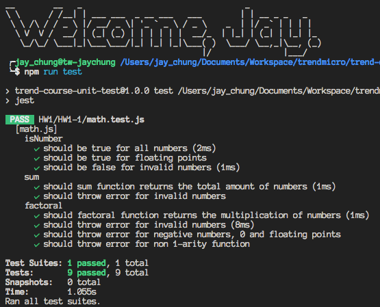
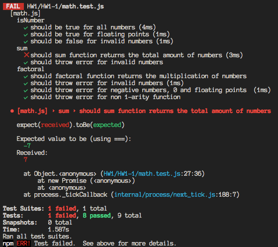

# Unit Test demo project

> This project is part of 2017 R3: unit test course by Any Tzeng

The unit test processes of this whole project are workings under [Jest](https://github.com/facebook/jest) framework.

## Installation

please assure that you have the node v7+ and npm

```sh
  npm i
```

## Run the tests

```sh
  npm t
```

## Assignments

Therer are assignment details below

### HW1 (20171101)

1. Familiar with one testing framework benefiting on your daily work
    - [x] To run thee cases
    - [x] To asser/verify testing result
    - [x] To assert/verify exception
    - [x] To perform setup and teardown flow

    Screenshot for **passing** test cases:

      

    if you change the expect of sum function to be the wrong answer on purpose, you will see the **failing** case below:

      


2. A mini-project that has the following requirements:
  - User interface to input City name to show current weather status
  - Invoke weather API from OpenWeatherMap (need free api key)
  - Following information needs to be output: `temperature`, `min/max temperature`, `humidity`, `cloudiness`, `data forecasted time`
  - Write test program of mini-project against what you think it can be tested

Please go the the repo: [Open Weather App](https://github.com/xJkit/open-weather-app) for more detail.